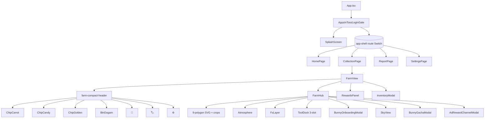
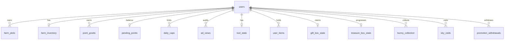
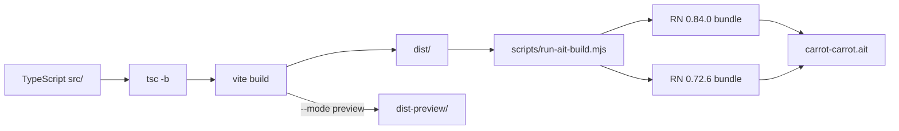

# ARCHITECTURE.md

Snapshot reference: working tree on `2835795` (HEAD) + uncommitted Bag PR scaffolding. See `PROJECT_STATE.md § C` for the working-tree delta.

---

## 1. Component hierarchy



Component → file map:

| Component | File |
| --- | --- |
| `App` | `src/App.tsx` |
| `AppsInTossLoginGate` | `src/components/AppsInTossLoginGate.tsx` |
| `SplashScreen` | `src/components/SplashScreen.tsx` |
| `TabBar` | `src/components/TabBar.tsx` |
| `HomePage` | `src/pages/HomePage.tsx` |
| `CollectionPage` / `FarmView` | `src/pages/CollectionPage.tsx` |
| `ReportPage` | `src/pages/ReportPage.tsx` |
| `SettingsPage` | `src/pages/SettingsPage.tsx` |
| `FarmHub` | `src/features/collection/FarmHub.tsx` |
| `Atmosphere` | `src/components/Farm/Atmosphere.tsx` |
| `FxLayer / HarvestPop / DirtBurst / PngBurst / PerfectCombo` | `src/components/Farm/Effects/index.tsx` |
| `ToolDock` | `src/components/Farm/ToolDock.tsx` |
| `SkyView` | `src/components/Farm/SkyView.tsx` |
| `RewardsPanel` | `src/components/Farm/RewardsPanel.tsx` |
| `BunnyOnboardingModal` | `src/features/collection/BunnyOnboardingModal.tsx` |
| `InventoryModal` | `src/components/Inventory/InventoryModal.tsx` |
| `BunnyGachaModal` | `src/components/Inventory/BunnyGachaModal.tsx` |
| `AdRewardChannelModal` | `src/components/Inventory/AdRewardChannelModal.tsx` |

## 2. Data flow — user action → client → worker → D1

```mermaid
sequenceDiagram
  actor User
  participant UI as React (FarmHub etc.)
  participant Store as Zustand store
  participant Sync as farmSync.ts
  participant API as apiCall (lib/api.ts)
  participant Worker as Hono worker
  participant DB as Cloudflare D1

  User->>UI: tap ripe plot
  UI->>Store: harvest(id) (optimistic)
  Store-->>UI: stages[id]=0, carrots++
  Store->>Sync: growOnServer / harvestOnServer
  Sync->>API: POST /farm/harvest {slotIndex,seedDelta}
  API->>Worker: bearer JWT + body
  Worker->>Worker: requireUser → verifyAppJwt
  Worker->>DB: UPDATE farm_plots SET stage=0 …
  Worker->>DB: INSERT/UPDATE farm_inventory SET carrots+1
  DB-->>Worker: ok
  Worker-->>API: { ok, plots, carrots, seeds }
  API-->>Sync: result
  Sync-->>Store: applyRemote(state)
  Note over Store,UI: store reconciles; optimistic state replaced
```

Failure paths: when `tokenStore.getAccess()` is empty (preview/guest) or `apiBaseUrl()` is empty, `farmSync` returns `NOOP_OK` and the store stays on its optimistic state — UI keeps working.

## 3. Zustand stores

| Store | File | Persist | Responsibility |
| --- | --- | --- | --- |
| `useFarmStore` | `src/features/collection/farmStore.ts` | mostly in-memory; mirrors server `/farm/state`. Local farm `seeds` / `candyCarrots` / `goldenCarrots`. | Plots (length 9), carrots, seeds, candyCarrots, goldenCarrots, perfect-combo snapshot id, hydrated flag. Actions: `plant / harvest / cycleDebug / growAllPlanted / incCandyCarrots / incGoldenCarrots / reset / hydrate`. |
| `useToolStore` | `src/features/collection/toolStore.ts` | in-memory + KST day-key rollover | Selected tool (`shovel / watering_can / basket`), watering_can charges (10/day), ad-refill counter (3/day). Actions: `select / spendWatering / refillFromAd / rolloverIfNeeded / hydrateFromRemote`. |
| `useItemsStore` | `src/features/collection/itemsStore.ts` | `safeStorage` key `cc.items.v1` | 13-item inventory counts. Actions: `add / consume / speciesOwned / reset`. |
| `useRewardsStore` | `src/features/collection/rewardsStore.ts` | `safeStorage` keys `cc.rewards.giftDay.v1` + `cc.rewards.medals.v1` | Medal set + daily-gift claim flag. Actions: `claimDailyGift / unlockMedal / reset`. |
| `useCollectionStore` | `src/features/collection/collectionStore.ts` | safeStorage (legacy) | Legacy dogam stats: total carrots, streak, owned characters, daily history, first-fifty flag. Actions: `applySession / applyAbandon / resetAll / forceUnlock`. |
| `useTimerStore` | `src/store/timerStore.ts` | safeStorage `cc.timer.*` | Focus timer state + snapshot of last completion. |
| `useSoundStore` | `src/store/soundStore.ts` | safeStorage | Background sounds + sound-pass expiry + permanent unlocks. |
| `useUserStore` | `src/store/userStore.ts` | in-memory | Auth/user shadow state. |

## 4. Worker routes (Hono)

Entry: `cloudflare/workers/carrot-carrot-api/src/index.ts`. All routes are bearer-JWT guarded via `requireUser()` (defined in each route file or `lib/jwt.ts`) **except** `/health` and `/login`.

| METHOD | PATH | Auth? | Handler | Status |
| --- | --- | --- | --- | --- |
| GET | `/health` | no | `routes/health.ts` | mounted, live |
| POST | `/login` | no (uses authorizationCode) | `routes/login.ts` | mounted |
| GET | `/me` | yes | `routes/me.ts` | mounted |
| POST | `/refresh` | yes | `routes/refresh.ts` | mounted |
| POST | `/unlink` | yes | `routes/unlink.ts` | mounted |
| GET | `/farm/state` | yes | `routes/farm.ts` | mounted |
| POST | `/farm/plant` | yes | `routes/farm.ts` | mounted |
| POST | `/farm/grow` | yes | `routes/farm.ts` | mounted |
| POST | `/farm/harvest` | yes | `routes/farm.ts` | mounted |
| GET | `/economy/balance` | yes | `routes/economy.ts` | mounted; falls back to 0 when migration not applied |
| POST | `/economy/withdraw` | yes | `routes/economy.ts` | mounted; **503 CONFIG_REQUIRED** / 501 stub. Real Toss `executePromotion` not wired. |
| POST | `/economy/ad-view` | yes | `routes/economy.ts` | mounted; logs status; ad-token verification TODO |
| GET | `/tools/state` | yes | `routes/tools.ts` | mounted; auto-rollover at KST midnight |
| POST | `/tools/use` | yes | `routes/tools.ts` | mounted; decrements watering_can |
| POST | `/tools/refill` | yes | `routes/tools.ts` | mounted; ad-token verification TODO |
| POST | `/tools/seed` | yes | `routes/tools.ts` | mounted; alias for /farm/plant + state |
| POST | `/tools/harvest` | yes | `routes/tools.ts` | mounted; alias for /farm/harvest + state |
| GET | `/items/inventory` | yes | `routes/items.ts` | **route file exists but not mounted in `index.ts`** |
| POST | `/items/use` | yes | `routes/items.ts` | **file exists but not mounted** |
| POST | `/boxes/gift/open` | yes | `routes/boxes.ts` | **file exists but not mounted** |
| GET | `/boxes/treasure/state` | yes | `routes/boxes.ts` | **file exists but not mounted** |
| POST | `/boxes/treasure/open` | yes | `routes/boxes.ts` | **file exists but not mounted** |

> Mounting `items.ts` and `boxes.ts` is a 4-line follow-up: import + `app.route("/items", itemsRoute)` + `app.route("/boxes", boxesRoute)`.

## 5. D1 schema



Tables by migration:

| Migration | Tables added |
| --- | --- |
| `0001_init.sql` | `users` (PK = `user_key TEXT`) — name/email encrypted columns + gender + created_at + last_login_at |
| `0002_farm.sql` | `farm_inventory` (user_key, carrots) · `farm_plots` (user_key + slot_index PK, stage 0–4) + `farm_plots_user_idx` |
| `0003_economy.sql` | `pending_points` · `point_grants` · `daily_caps` · `ad_views` · `promotion_withdrawals` (+ indexes) |
| `0004_farm_seed_rewards.sql` | `ALTER TABLE farm_inventory ADD COLUMN seeds INTEGER NOT NULL DEFAULT 0` |
| `0005_tools.sql` | `tool_state` (user_key, watering_can_left, watering_can_resets_at, ad_refills_today) |
| `0006_items.sql` *(not applied)* | `user_items` (user_key+code PK) · `gift_box_state` · `treasure_box_state` · `bunny_collection` (+ idx) · `sky_visits` (user_key+ymd PK) · `ad_redeem_nonces` |

Key invariants in code:

- All point math hard-coded as carrot=1, candy=5, golden=10. Don't change without coordinating with `0003_economy.sql` daily cap.
- `farm_plots.stage` CHECK constraint enforces 0..4.
- `daily_caps.ymd` is `YYYY-MM-DD` in **KST**, computed in the worker.

## 6. External dependencies

| Concern | Library / runtime |
| --- | --- |
| UI | `react`, `react-dom`, `framer-motion`, `wouter` |
| State | `zustand` |
| Icons | `lucide-react` (reserved; current nav icons are hand-rolled SVG) |
| Toss SDK | `@apps-in-toss/web-framework` (used by `src/lib/appsInTossLogin.ts`, `tossRewardedAd.ts`) |
| Cloudflare | `hono` (worker framework). D1 binding name from `wrangler.toml`. |
| Build | `vite`, `@vitejs/plugin-react`, `typescript`, `esbuild` (test loader), `sharp` (icon pipeline), `png-to-ico` |
| Assets | `bunny_assets-abcug.zip` provided by user — extracted into `public/assets/farm/` (sky/rewards/icons/foods/tools). Sources tracked in `assets-missing.md`. |

## 7. Build pipeline



Pipeline notes:

- `scripts/check-build-env.mjs` enforces `VITE_APPS_IN_TOSS_PROXY_URL` (worker URL) is set before submission/AIT builds. Preview builds skip this check via `.env.preview`.
- `scripts/run-ait-build.mjs` orchestrates two React Native bundles (Apps-in-Toss WebView ships two RN versions) and zips them into `carrot-carrot.ait`.
- `scripts/package-source.mjs` writes a source archive with `REQUIRED_AIT_FILES = ["granite.config.ts", "package.json", "index.html"]` integrity check.

## 8. Storage / asset-path policy

- All client-side persistent state goes through `src/lib/safeStorage.ts`. The shim resolves `window["localS" + "torage"]` so the literal `localStorage` token never appears in the built JS.
- Every asset URL is composed as `` `${import.meta.env.BASE_URL}…` ``. Vite resolves this to `./` per `vite.config.ts → base: "./"` so the build is nested-proxy safe (Perplexity preview, Cloudflare Pages preview, etc.).
- Toasts on the farm sub-view render as outlined text (no pill chrome). Controlled by `body[data-farm-view="1"] [data-cc-toast-pill]` in `src/design-system/base.css`.

## 9. Reward math (single source of truth)

| Helper | File | Purpose |
| --- | --- | --- |
| `getFocusFarmReward(min)` | `src/lib/farmRules.ts` | 5-min gate + tier table → `{ valid, growSteps, seedDelta, message, tier }` |
| `pointsFor(kind, n) / totalPoints(inv) / canWithdraw(p)` | `src/lib/points.ts` | Carrot/candy/golden → Toss-points conversion |
| `rollHarvestGacha(opts)` | `src/lib/seasonalBunny.ts` | Per-harvest gacha (bunny 0.5 % / golden 1 % / candy 4 %) |
| `drawBunny(opts)` | `src/lib/bunnyGacha.ts` | 4-tier bunny pool draw (common 70 / rare 22 / epic 7 / legendary 1) |
| `rollTable(table, rng)` | `src/lib/rewardTables.ts` | Daily-gift / weekly-treasure RNG roll |
| `pickFarmBackgroundSlot(now)` | `src/lib/farmBackground.ts` | KST hour → bg slot |
| `pickSkyMessageAt(slot, idx)` | `src/lib/skyMessages.ts` | Cyclic message picker |

All helpers are pure (no React, no DOM, no fetch) and unit-tested under `src/lib/*.test.mjs`.
